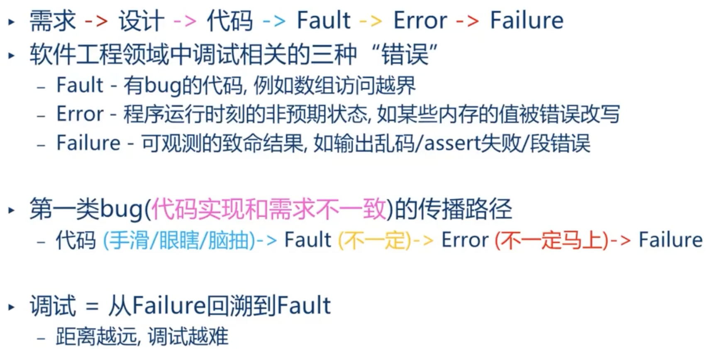

# 概述

本文档为[moe库初代版本KousakaReina](https://github.com/ipChrisLee/moe/tree/KousakaReina-1.0.0)的介绍性文档，主要介绍moe库的来源，以及各个部分的用法和设计逻辑和常用场景。


Kousaka Reina镇楼（误）。


# moe库的起源

本人ipLee在参加[2022全国大学生计算机系统能力大赛编译系统设计赛](https://compiler.educg.net/#/index?name=2022全国大学生计算机系统能力大赛编译系统设计赛&index=1&img=0)时第一次写大项目，当时考虑到大项目需要一些比较常用的功能，于是自己实现了一个库。当时编译系统设计赛我的作品名为MoeCompiler，意为“萌编译器”（neta自萌娘百科网址moegirl.org.cn），于是这个来自于MoeCompiler的支持开发的库就命名成了moe。

值得注意的是，当时[MoeCompiler使用的moe库](https://github.com/ipChrisLee/MoeCompiler/tree/moe/src/mlib)有非常明显的[过度设计](https://www.zhihu.com/question/19993179)的倾向，最直接的表现是：大多数我亲手写下的代码并不会被我自己用上哪怕一次，而用得上的代码里相当一部分又因为设计缺少思考导致极其难用。在吸取了这个教训之后，我改良了整个库的设计，让它保证：

* 需要时增加。
* 设计尽可能简单。
* “傻子”都能使用。

并且我也参考了很多其他项目、语言（主要是Rust）的精华，具体设计思路可以参考文档。


我已经在多个个人项目中使用了现在版本的moe库，个人感觉是省下了很多时间的。

本代码库使用GPL-2.0开源协议。


此外，如果你有任何想法， 可以pr，或者直接微信/邮箱和我交流。


# moe库的编译环境

moe是C++库，语言标准是C++17，本地使用下述clang++版本编译过，未出现问题。

```
Homebrew clang version 15.0.3
Target: x86_64-apple-darwin21.6.0
Thread model: posix
```

如果你发现在你的本地无法正常编译，欢迎提issue和我交流。


# 库的基本特征

* 名空间保护：

  几乎所有的特性都是用`moe`这个`namespace`包裹。

  对于宏这种没有namespace的东西，都使用`moe_`作为前缀，防止与其他库放在一起冲突。
  
* 编译保护：

  所有hpp文件都加了`#pragma once`，防止重定义。


# 分库介绍

## moe_typedef.hpp

### 介绍

[moe_typedef.hpp](https://github.com/ipChrisLee/moe/blob/KousakaReina-1.0.0/moe/moe_typedef.hpp)里引入了一些对整数的重命名。比如用`i32`代替一般意义下的`int`。


### 使用方法

include这个文件之后，就可以直接使用诸如`i32`、`i8`这些定义。

具体有`i8`, `i16`, `i32`, `i64`, `u8`, `u16`, `u32`, `u64`。


### 为什么要设计这个库

在C/C++中，`int`、`long`、`long long`这种整数类型的语义其实是不太完全的：你无法第一眼就明白一个`long`是32位的（当然熟悉C/C++的人是可以马上反应过来的，但是这终究不是“第一反应”），一个`long long`是64位的，更别提`int`在不同的机器上位数还不一样。

在Rust中，这些整数类型都变成了语义明确的`i32`、`i64`，我也参考了这个设计。


### 问题

但是目前的moe_typedef.hpp有一个非常严重的问题：这种类型定义肯定是越简单越好，所以我没有为它引入namespace，但是举个例子，比如你代码已经有对`i32`做了定义，再直接/间接include了这个文件这就会产生冲突。

为了兼容性，这个大版本的moe库可能不会着手这个问题。当然我也没想清楚应该怎么解决这个问题。。。如果您有想法欢迎和我交流。

此外还有一个问题：由于C语言遗留问题，所以`i8`虽然语义上是一个整数，但是被`ostream`输出时会被当作一个`char`。。。这个也属于不好解决的问题。


## moe_macro.hpp

### 介绍

这个文件里都是一些库里需要用到的宏定义，包括字符串拼接之类的。

这些宏全部使用`MOE_`开头，避免出现重定义。

大多数情况下你不需要直接使用这个库。


## rt_check.hpp

### 介绍

这里rt是runtime的意思。

这个文件引入了运行时代码检测，包括：

* `moe_panic(msg)`宏，输出消息、当前位置并直接结束程序的宏。
* 执行了就会输出位置并直接结束的`moe_rt_todo()`宏。
* 判断传入条件真假，为假就会输出消息、当前程序位置并直接结束程序的`moe_assert(...)`宏。


### 为什么要设计这个库

在项目设计中，assert和todo可以说是非常常用的函数（它们常用到Rust专门在语言层面支持了它们），但是在C++中，只有比较残废的assert，todo甚至没有。

#### 关于assert的重要性

下图部分介绍了bug是fault->error->failuer的顺序来的，而assert的作用就是限制这个传播链，让error尽可能马上地暴露出来，进而尽快定位到底在哪错了。



这个图来自[DiffTest介绍(余子濠, 王华强) [第三期“一生一芯”计划 - P5]](https://www.bilibili.com/video/BV1824y127cX)的11分钟左右。我个人不是很喜欢“一生一芯”项目里的部分做法，不过这个视频还是很有意思的。

#### 关于todo的重要性

写代码时有时候需要面对这种情况：`a`的取值有`0`或者`1`，你想先完成`0`部分的代码，并且想要代码先通过编译、完成测试。此时你希望的是：在`a`为`1`时直接结束代码，那么很明显一个思路是：

```c++
switch (a) {
    case 0:
        /* ... */
        break;
    case 1:
        cerr<<"todo"<<std::endl
        exit(-1);
        break;-
}
```

这么写思路是对的，但是有两个问题：

* 麻烦，你要写两行。
* 你执行代码的时候可能会有多个todo的情况，执行失败之后你不知道哪个todo被触发了。

为了避免这个问题，可以使用一个宏代替。也就是`moe_rt_todo()`宏。

当然，还有一种情况是你想保证在你完成某个todo之前都不允许代码通过编译，那就可以使用`moe_todo()`宏解决。


### 使用方法

```c++
int a=0;
moe_assert(a==0);
moe_assert(a==0, "Message.");
switch (a) {
    case 1:
        moe_rt_todo();
        break;
    case 0:
        moe_todo();	//	不想本代码过编译直到完成这部分代码。
        break;
}
```


### 问题

有一个问题是，现在大多数编辑器都支持`TODO`高亮，但是以CLion为例，本todo宏就不支持这个高亮。


## empty_function.hpp

### 介绍

空函数模板。后续的一些函数会用到这个空函数。


### 使用

```c++
auto func1 = moe::empty_func<void, int>; // 输入int，输出void
auto func2 = moe::empty_func<void>;		//	无输入，输出void
auto func3 = moe::empty_func<int>;		//	无输入，输出int
auto func4 = moe::empty_func<int, float>;	//	输入float，输出int
```


## debugger.hpp

### 介绍

这个库是我虚(zhi)心(jie)借(zhao)鉴(ban)自[sharkdp/dbg-macro](https://github.com/sharkdp/dbg-macro.git)的。

当然，它是MIT标准，moe是GPL标准，引用代码应该没问题？。。。

大家可以去它的仓库看使用方法。


### 为什么要引用这个库

dbg是我在打ACM的时候就使用的宏，它是“输出调试法”的一部分。使用一个宏代替`cout`手动输出相对高效些。

Rust也在原生支持了这个库。


## log.hpp

### 介绍

这是日志库。分成两种：

* 整体使用的`STDLog`，注册之后在任何位置可以使用。

* 函数内局部使用的`LocalLog`，初始化后在生命周期内可以使用。

  `LocalLog`支持自动indent。


### 使用方法

注册`STDLog`：调用`moe::register_std_log`函数来注册`STDLog`，参数包括log文件路径、分隔符、每次输出时的header。

使用`STDLog`输出：调用`moe_slog_info()`宏。注意这里要求输入的对象支持`operator<<`，在输出时会使用传入的分隔符来分割各个部分内容。出于设计的简单考虑，没有设计复杂的格式控制方式，建议一次只log一个对象。

新建`LocalLog`：调用`moe_llog`宏，返回新建的对象。

使用`LocalLog`输出：调用`LocalLog`的`info`方法即可。


## arg_parser.hpp

### 介绍

用来解析命令行参数的库。


### 使用方法

这个库使用了非常简单的设计方法：库只解析命令行参数，把输入的字符串解析出来，使用者需要传入函数来解析字符串。

举个例子，对于clang这种编译器，可以使用下述方式解析：

```c++
struct CompilerInfo {
    bool help;
    int optiLevel;
    std::string outPath;
    std::vector<std::string> files;
} cInfo{false, 0, "", { }};
auto argParser = moe::ArgParser("STD Compiler");
argParser.add_option(
    moe::ArgOption(
        'h', std::nullopt, false, [&cInfo](std::string_view) {
            cInfo.help = true;
        }, "Print help info before parsing."
    )
);
argParser.add_option(
    moe::ArgOption(
        'o', std::nullopt, true, [&cInfo](std::string_view path) {
            cInfo.outPath = path;
        }, "Output exe file path."
    )
);
argParser.add_option(
    moe::ArgOption(
        'O', std::nullopt, true, [&cInfo](std::string_view optiLevel) {
            std::from_chars(optiLevel.begin(), optiLevel.end(), cInfo.optiLevel);
        }, "Opti level of your compiler."
    )
);
argParser.add_func_to_handle_non_option_arg(
    [&cInfo](std::string_view path) {
        cInfo.files.emplace_back(path);
    }
);
argParser.parse(argc, argv);
```

解释一下这种设计思路的好处：所有的解析方式都由用户自己定义。可以看出来，这个设计下代码是简单易懂的。

别的命令行参数解析库往往都会支持自动解析，但是我觉得这样会加大代码耦合程度，进而导致代码变得复杂，反而不利于设计。


## decorator.hpp

### 介绍

用于在命令行输出染色字符的库。

原理很简单，命令行染色的本质就是输出一系列字符，然后由shell完成渲染。所以想要染色的时候输出一些字符就行。


### 使用方法

```c++
std::cout << moe::set_decorator(moe::bg_blue, moe::c_red, moe::d_underline)
          << "Hello! ";
std::cout << "How are you?" << std::endl;
std::cout << moe::set_decorator(moe::bg_cyan, moe::c_black, moe::d_bold)
          << "Fine, thank you! And you?" << std::endl;
std::cout << moe::set_decorator(moe::reset);
std::cout << "End of communication" << std::endl;
```

结果：


## time_pro.hpp

### 介绍

C++17了，C++标准库里居然还没有简单易用的时间获取函数！

这里定义的就是这个。


### 使用方法

`moe::now::day()`、`moe::now::hour()`、`moe::now::minute()`、`moe::now::second()`分别输出`i32`类型的目前的“日”、“时”、“分”和“秒”。

`moe:now::formatTime()`则输出`HH:MM`格式的24小时制时间。


## restorer.hpp

### 介绍

在写编译器的时候，有时候会遇到这种场景：我想在函数的开始将`a`自增1，但是要在函数结束的时候变回去。

在C++这种面相对象语言里，因为会保证在函数结束时析构局部变量，所以可以用类做到这个。


### 使用方法

```c++
int a;
void fun(){
    moe_r_set(a, a+1);
    int b=0;
    moe_r_set(a, std::move(b));	//	NOLINT
}
```

可以保证在返回时a的值变成原来的值。

可以用于自定义类型，但是必须保证：

1. 自定义类型有移动赋值函数。
2. 自定义类型右移动构造函数。


### 问题

目前的设计有一些问题，比如我在模板里就强行要求了`newVal`（也就是`moe_r_set`的第二个参数）必须为右值，也就是即使你对`int`这种基础类型，也必须加`std::move`——这本来不是问题，但是问题在于：部分编译器会对这个行为加warning，虽然可以通过加`// NOLINT`来避免warning提示（上面的例子），但是终究还是需要额外的关注。

此外，下面的做法是不行的：

```c++
auto str = std::string();
moe_r_set(str, "??");
```

必须改成`moe_r_set(str, std::string("123"))`。

可能在后续版本解决这个问题吧。


## 一些其他库

还有一些杂七杂八的库，这里就不专门介绍了，可以去看源码：

* fmt_string.hpp

* moe_concept.hpp

  这里面的`Cloneable`是使用智能指针的仿Java`Cloneable`。

* stl_pro.hpp

